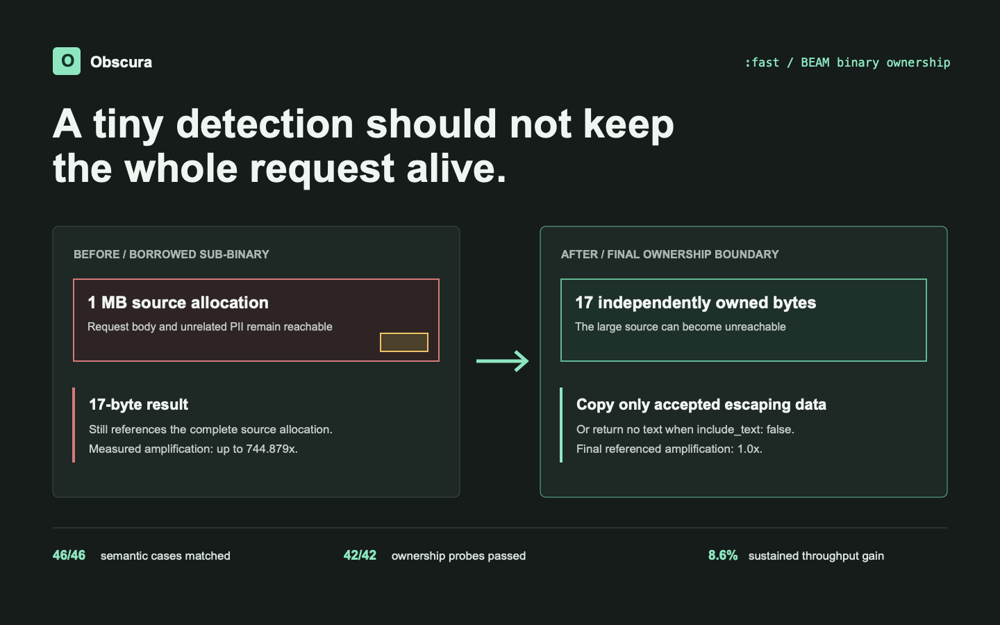

# Making PII Detection Faster Without Keeping the Input Alive

A result containing sixteen bytes can keep a one-megabyte request alive.

That was the uncomfortable fact behind an optimization pass on Obscura's
dependency-light `:fast` profile.

The profile was already quick on normal inputs. It uses deterministic
recognizers instead of a model, so there is no checkpoint to load and no GPU
involved. The obvious goal was to reduce repeated work on large payloads.

The less obvious goal was more important: a small detection result should not
retain the allocation that held the entire request.

Those goals interact. Copy every match too early and the memory problem
disappears, but ordinary requests get more expensive. Never copy and a caller
holding one result may accidentally hold megabytes of unrelated PII.

I wanted a narrower result:

1. preserve exact entities, offsets, scores, metadata, and ordering;
2. avoid building text and NLP artifacts that the caller did not request;
3. copy only data that actually escapes;
4. prove the returned object graph does not borrow the input allocation;
5. measure the result against the pre-optimization implementation.

The work started as a performance exercise. It ended as a lesson in BEAM
binary ownership, extension API design, and what a benchmark must prove before
its numbers are trustworthy.



## The Result in One Minute

- **Root cause:** `:fast` performed whole-input NLP work that most
  deterministic requests never used, while small result binaries could retain
  much larger input allocations.
- **Implementation:** build NLP artifacts lazily, avoid constructing disabled
  result text, and establish binary ownership only after filtering determines
  which data will escape.
- **Compatibility:** all 46 semantic benchmark cases and all three
  authoritative accuracy fingerprints remained unchanged.
- **Performance:** common requests improved modestly, large-input p50 improved
  by 67% to 98%, and sustained throughput improved by 8.6%.
- **Memory evidence:** all 42 returned-term ownership probes found no borrowed
  input allocation, and both targeted 30-minute soaks reached a stable
  plateau.
- **Limit:** this proves ownership for the tested returned terms. It does not
  prove secure erasure, prevent malicious callbacks from retaining input
  elsewhere, or make intentionally returned metadata non-sensitive.

## The Profile I Was Optimizing

Obscura exposes three stable profiles. `:balanced` and `:accurate` add local
model-backed named entity recognition. `:fast` resolves to
`:deterministic_plus`.

That means `:fast` is intended for identifiers with useful structure:

- email addresses;
- phone numbers;
- credit cards;
- Social Security numbers;
- URLs and domains;
- IP addresses;
- IBANs;
- dates, titles, and context-labeled deterministic entities.

The profile is dependency-light and runs on the BEAM. It is the path I would
choose for request filtering, log protection, and structured data when a model
is unnecessary or unavailable.

Its detection API can return the matched value:

```elixir
{:ok, result} =
  Obscura.analyze(
    "Contact alice@example.com",
    profile: :fast,
    entities: [:email]
  )

[email] = result.results
email.text
#=> "alice@example.com"
```

Or the caller can ask for offsets without returned match text:

```elixir
{:ok, result} =
  Obscura.analyze(
    "Contact alice@example.com",
    profile: :fast,
    entities: [:email],
    include_text: false
  )

[email] = result.results
email.text
#=> nil
```

That second form is useful at privacy-sensitive boundaries. If downstream code
needs only entity types and byte ranges, returning the source value adds risk
without adding information.

But setting `text: nil` does not, by itself, prove that the input is no longer
retained.

## The Small-Result, Large-Input Problem

BEAM binaries are optimized for sharing. A slice can refer to bytes inside a
larger binary instead of copying them.

That is usually exactly what an application wants.

Consider a large request ending in one email address:

```elixir
source =
  String.duplicate("x", 1_000_000) <>
    " alice@example.com"

match = binary_part(source, 1_000_001, 17)

byte_size(match)
#=> 17

:binary.referenced_byte_size(match)
#=> approximately 1_000_018
```

The visible value is seventeen bytes. Its backing allocation can be the whole
request.

If a GenServer, ETS table, task result, telemetry handler, or caller retains
that slice, the large source allocation remains reachable too. The application
has not leaked the value outside the VM, but it has extended the lifetime of
PII that the result does not need.

This distinction is easy to miss because ordinary inspection shows the small
value:

```elixir
inspect(match)
#=> "\"alice@example.com\""
```

The allocator relationship is invisible unless it is measured.

The original Obscura path could return that kind of borrowed match text.
Measured probes found referenced-size amplification as high as:

| Result path | Before | After |
| --- | ---: | ---: |
| Short email with text | 5,461x | 1.0x |
| Long URL with text | 744.879x | 1.0x |
| Batch result containing a long URL | 744.879x | 1.0x |
| Custom recognizer borrowed text | 258.732x | 1.0x |
| Deny-list text | 619.195x | 1.0x |

The final result still contains PII when `include_text: true`. It simply owns
the bytes it exposes instead of retaining unrelated bytes from the request.

Ownership is not redaction. It is a lifetime boundary.

## Why Copying Every Match Was the Wrong Fix

The simplest repair would have been:

```elixir
owned = :binary.copy(match)
```

Doing that in every recognizer would solve the obvious sub-binary case. It
would also spread ownership policy across many modules, copy candidates later
rejected by thresholds or conflicts, and duplicate work for callers using
`include_text: false`.

Obscura recognition is a pipeline:

1. recognizers produce candidates;
2. allow lists and context can reject them;
3. thresholds remove low-confidence candidates;
4. conflict resolution chooses accepted spans;
5. the analyzer returns the final results.

Only the last step knows which values escape.

The implementation therefore moved ownership into central final assembly.
Candidate filtering happens first. Accepted result fields are then normalized:

- a borrowed byte-aligned binary is copied;
- an already owned binary is reused;
- a non-byte-aligned bitstring is copied;
- nested transparent metadata and explanations are traversed;
- `Result.text` remains `nil` when a custom recognizer intentionally omitted
  it;
- `include_text: false` removes returned result text.

The important part is the timing. Copy at the boundary, not at every possible
match.

## Stop Constructing Text That Will Be Discarded

Central ownership fixes retained sub-binaries. It does not explain the largest
speed improvements.

The first performance rule was simpler:

> If the caller requested no match text, do not construct match text in the
> first place.

Built-in recognizers now honor `include_text` while creating candidates.
Address, domain, location, person, deny-list, and pattern paths avoid storing a
source slice when text is disabled.

There are deliberate exceptions. A configured allow list may need the source
value temporarily to decide whether to reject a candidate. A parser-backed
phone validator needs a temporary value to parse it.

Temporary borrowing inside the call is not the same as retained borrowing in
the returned result.

That distinction also prevents misleading documentation. `include_text:
false` controls `Result.text`; it is not a universal metadata sanitizer. A
phone parser can still return normalized `:phone_e164`, and a trusted custom
recognizer can intentionally return sensitive metadata.

Callers must treat those documented fields as sensitive even when their
binaries are independently owned.

## The Bigger Performance Cost Was Work Nobody Used

The dependency-light analyzer used to construct NLP artifacts for every input
before deterministic recognizers ran. That included token and lemma work over
the complete source.

Most `:fast` requests did not use those artifacts.

A no-match one-megabyte input still paid to tokenize one megabyte. A large
input with one structured identifier did the same, even when no accepted
result required context.

The analyzer now defers artifact construction when all of these are true:

- the resolved profile is `:deterministic_plus`;
- no custom recognizers are configured;
- no explicit NLP artifacts were supplied;
- no NLP engine was configured.

Context processing builds artifacts lazily only if a result or caller context
actually needs token-aware matching.

This condition matters. Custom recognizers are part of Obscura's stable API and
can depend on central artifacts. An optimization that silently stopped
supplying them would be fast and wrong.

The diagnostics changed with the implementation. Lazy tokenization is recorded
as `:nlp_artifacts`; context enhancement and acceptance filtering remain
separate stages. Otherwise an operational profile would attribute the cost to
the wrong component.

## The Review Kept Finding Less Obvious Retention Paths

The first implementation handled `Result.text`. That was not enough.

A result is an object graph, not one field.

Custom validators and recognizers can return metadata and explanations.
Parser-backed phone recognition can return normalized values. Functions can
capture variables in closure environments. Maps can contain nested maps,
tuples, lists, structs, binaries, and bitstrings.

Several adversarial cases exposed paths the initial ownership pass did not
cover:

- callback metadata containing a borrowed source slice;
- malformed metadata raising an exception that included raw PII;
- a function closing over part or all of the input;
- a near-full non-byte-aligned bitstring whose rounded `byte_size/1` matched
  the source size;
- a malformed map using `:__struct__` as an ordinary value;
- reserved context metadata with an invalid type;
- parser metadata returned while `include_text: false`;
- an offset-only custom result whose intentional `text: nil` had to remain
  compatible.

This was not evidence that the whole implementation was bad. It was evidence
that “returned result” had initially been defined too narrowly.

The correction introduced two different policies.

Recursively transparent terms can be inspected and detached. Serializable
function metadata remains compatible, but the closure is cloned through
Erlang's external term format so captured binaries and bitstrings no longer
borrow the caller's allocation.

Malformed callback results are rejected with sanitized structured errors
before downstream processing can raise and print the source value.

The result is deliberately conservative, but it preserves the documented
extension contract. Harmless function metadata and independently owned values
remain valid.

## Binary Ownership Is Not the Same as No PII

This became the most important distinction in the test harness.

These are different questions:

1. Does a returned binary borrow a larger allocation?
2. Does any returned value contain sensitive content?
3. Can a caller-provided callback retain its input through external state?
4. Has freed memory been cryptographically erased?

The implementation can control the first question for accepted returned terms.
It can minimize the second through `include_text: false`, but documented
metadata and trusted extensions may intentionally contain PII.

It cannot prevent a malicious callback from writing its input to another
process, ETS, disk, or a remote service. It also cannot promise secure erasure
from BEAM or native allocator memory.

So the final claim is narrow:

> In the tested built-in and controlled extension paths, recursively
> inspectable returned terms and accepted serializable closure environments do
> not borrow the larger input allocation.

That is useful. It is also not the same as “no sensitive value exists
anywhere.”

## A Faster Result Is Meaningless If Its Behavior Changed

The benchmark harness originally compared a candidate output with another
output from the same candidate.

That catches nondeterminism. It does not catch a deterministic regression.

If both runs omit an entity, corrupt a score, reverse a list, or remove
pseudonymization metadata, the self-comparison still passes.

The final harness uses an external baseline report as a semantic oracle. Each
case declares an expected result and computes a fingerprint covering the
observable output:

- entity types;
- offsets;
- scores;
- result and operator metadata;
- ordering where ordering is part of the API;
- controlled error shapes;
- structured output.

Map-root structured traversal is canonicalized because map enumeration is
unordered. List-root structured output retains item order in the fingerprint.
Volatile pseudonymization use counts are normalized only when the field remains
present, positive, and integral.

The matrix grew to 46 cases:

- batch sizes 1, 8, 32, and 128;
- every anonymization operator;
- Logger and Plug integration paths;
- every built-in entity;
- four input scales;
- matches at different positions;
- multibyte and malformed input;
- dense and overlapping matches;
- parser-backed and disabled phone modes;
- ordered structured results.

All 46 final fingerprints and semantic expectations matched the external
baseline.

The authoritative accuracy reports also remained byte-for-byte equivalent at
the entity-output level across three datasets:

| Dataset | Precision | Recall | F1 | Output changed? |
| --- | ---: | ---: | ---: | --- |
| Generated heldout | 0.9618 | 0.5101 | 0.6667 | No |
| Synth v2 | 0.9349 | 0.4844 | 0.6382 | No |
| Nemotron subset | 0.8037 | 0.2729 | 0.4074 | No |

This optimization did not improve recognition accuracy. It preserved it
exactly.

## What Actually Became Faster

The clean comparison used the same finalized harness on the pre-optimization
revision and the final implementation.

The clearest microbenchmark results were:

| Case | Baseline p50 | Final p50 | Change |
| --- | ---: | ---: | ---: |
| Common request, no returned text | 110.417 µs | 105.375 µs | 4.6% faster |
| Common request, with text | 110.000 µs | 108.417 µs | 1.4% faster |
| One email match in 1 KiB | 196.458 µs | 64.708 µs | 67.1% faster |
| One match in 64 KiB, no text | 9,357.250 µs | 807.084 µs | 91.4% faster |
| One match in 64 KiB, with text | 9,376.250 µs | 800.584 µs | 91.5% faster |
| One match in 1 MiB, no text | 181,045.459 µs | 12,722.834 µs | 93.0% faster |
| Long URL in roughly 400 KiB | 66,225.806 µs | 1,541.583 µs | 97.7% faster |
| Detect plus redact | 118.834 µs | 108.416 µs | 8.8% faster |

The dramatic large-input gains came from avoiding eager whole-input NLP work.
The ordinary request gains are modest, which is what I expected from a path
that was already fast.

The branch accepted a small reduction-count increase on short, batch,
anonymization, and structured paths for centralized ownership handling.
Paired latency and throughput did not materially regress. Large-input
reductions fell by 67.3% to 86.3%.

One benchmark run is not a production workload, so I also compared the
operational matrix.

Across the three authoritative datasets, median warm p50 and throughput
improved at every tested concurrency from 1 through 16, with a few
sub-millisecond p95 and p99 rows moving upward by small amounts.

The shared sustained workload moved from 18,531 to 20,121 requests per second:
an 8.6% gain. It completed without failures, rejections, or timeouts and built
one reusable runtime.

I am not claiming universal p99 improvement. The generated-heldout p99 rows
were noisy, and the absolute differences were small.

## Proving That Results No Longer Borrow the Input

The retention harness does more than inspect `Result.text`.

It recursively walks returned maps, keys, values, structs, lists, tuples, and
function environments. It performs bit-level checks for non-byte-aligned
views. Each worker keeps the complete result live, forces garbage collection,
records process and VM binary observations, and releases the result only after
the snapshot.

The 42 cases cover analyzer, batch, anonymizer, structured, Logger, Plug,
custom recognizer, custom validator, parser metadata, explanation, error,
timeout, closure, bitstring, and vault paths.

All 42 reported:

- zero borrowed binaries or bitstrings in recursively traversable returned
  terms;
- zero forbidden source identities in adversarial bitstring and closure cases;
- normal holder termination after release;
- no retained result or mailbox value after the final garbage collection.

The harness separately reports intentional sensitive output. A parser-backed
phone result containing independently owned `:phone_e164` is still sensitive.
A custom callback intentionally returning a copied source value is still
sensitive. Those cases pass ownership and fail any claim that no PII was
returned.

That separation keeps the evidence honest.

## The Soak Tests Answered a Different Question

Ownership probes show whether a live result borrows its source allocation.
Soak tests show whether the tested workload exhibits sustained growth over
time.

They are related, but neither replaces the other.

A ten-minute canonical concurrency-4 run completed 11,529,716 requests at
19,216 requests per second with zero failures, rejections, timeouts, or output
mismatches. BEAM binary memory reached a plateau.

Two targeted thirty-minute runs mixed:

- unique large no-match inputs;
- large inputs containing one tiny match;
- many rejected candidates;
- offset-only results;
- bounded held and released owned text;
- structured large binary leaves;
- controlled callback failures.

Both concurrency-1 and concurrency-4 runs were classified as
`stable_plateau`. After release and garbage collection, the holder processes
had zero held results, zero binary bytes, and empty mailboxes.

RSS was recorded, but I did not use it as ownership proof. BEAM and native
allocators can retain freed pages, so resident memory is not a live-object
inventory.

## The Failed Experiments Were Useful

Not every plausible optimization survived measurement.

Reversing recognizer accumulation increased common latency by roughly 4% to
6%. Caching recognizer option keywords stayed below 1% and moved tails in both
directions. Trivial conflict-resolution fast paths reduced some no-match
reductions but did not pass the paired wall-time gate.

Those changes were reverted.

This matters because an optimization branch naturally rewards any number that
moves downward. Recording rejected experiments prevents that pressure from
turning noise into a feature.

The accepted work had two durable ideas:

1. build expensive NLP artifacts only when the request actually needs them;
2. enforce ownership once, at the boundary where accepted data escapes.

Everything else had to prove that it improved the complete system.

## What I Would Do Differently

I would define the ownership claim before writing the first optimization.

“Result text is copied” sounded precise at the beginning. It ignored metadata,
explanations, parser values, callback closures, bitstrings, errors, and holder
lifetime.

I would also build the external semantic oracle before collecting performance
numbers. A benchmark that validates itself can produce accurate timing for
incorrect behavior.

Finally, I would keep the performance and privacy gates separate from day one:

- semantic equivalence;
- latency and throughput;
- reductions and allocation observations;
- returned-term ownership;
- sensitive-content exposure;
- sustained memory behavior.

A single green “memory safe” label cannot represent all of those.

## Practical Guidance

For callers using Obscura:

- choose `include_text: false` when downstream code needs only entities and
  offsets;
- treat parser and custom-recognizer metadata as potentially sensitive;
- keep prepared runtimes reusable instead of rebuilding per request;
- do not use RSS alone to diagnose retained binaries;
- remember that independent ownership limits unrelated retention but does not
  sanitize the owned value.

For Elixir library authors, the broader lesson is not specific to PII:

> When a small returned value comes from a large input, measure the referenced
> binary size and inspect the complete returned object graph.

The final value can look tiny, benchmark quickly, and still keep the request
alive.

## Reproducing the Evidence

The complete commands, environment, revisions, benchmark tables, rejected
experiments, and limitations are in the
[fast-profile performance and binary-safety report](https://github.com/hfiguera/obscura/blob/main/docs/fast-profile-performance-and-binary-safety-report.md).

The proof tools are part of the repository:

- the
  [46-case semantic and performance harness](https://github.com/hfiguera/obscura/blob/main/eval/fast_profile/benchmark.exs);
- the
  [42-case returned-term ownership harness](https://github.com/hfiguera/obscura/blob/main/eval/fast_profile/retention.exs);
- the
  [targeted retention soak](https://github.com/hfiguera/obscura/blob/main/eval/fast_profile/soak.exs);
- the
  [binary-ownership contract tests](https://github.com/hfiguera/obscura/blob/main/test/obscura/analyzer/binary_ownership_test.exs).

The benchmark reference must come from a separate baseline worktree. Running
the candidate twice and comparing it with itself is not equivalent.

## What This Work Proves

For the tested `:fast` profile paths:

- all 46 semantic benchmark cases matched an external baseline;
- all three authoritative accuracy fingerprints remained unchanged;
- large-input p50 improved by roughly 67% to 98%;
- sustained throughput improved by 8.6%;
- all 42 returned-term ownership probes found no borrowed input allocation;
- two independent thirty-minute targeted soaks reached a stable plateau.

It does not prove secure erasure, universal absence of leaks, or that
caller-supplied callbacks cannot retain input through external state.

That is the boundary of the evidence.

The most useful outcome was not the fastest row in the table. It was making the
performance claim and the ownership claim independently testable.
