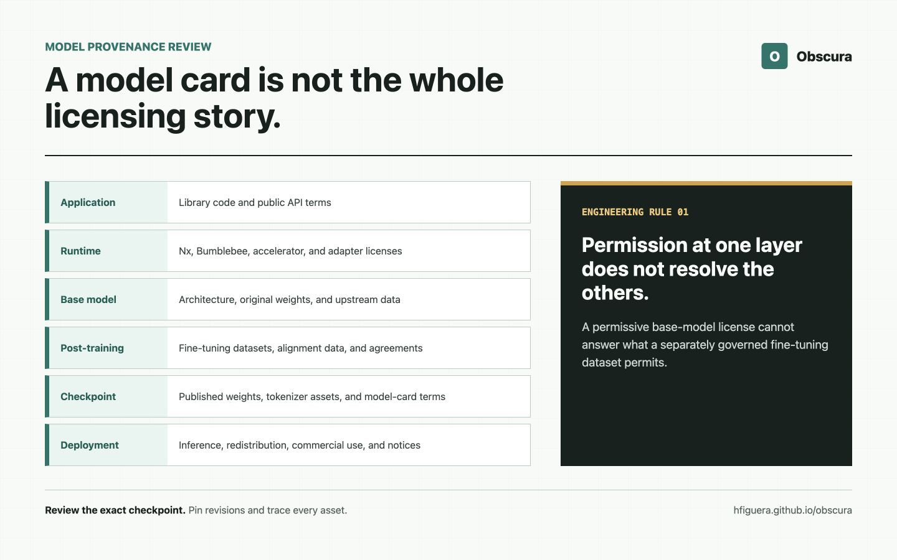

# A Model Card Is Not a License: What We Learned Shipping Local NER in Obscura

A base model can be published under MIT and a fine-tuned checkpoint built from
it can still require separate commercial authorization.

That sentence sounds contradictory until the model is treated as a supply
chain instead of one downloadable file.

I ran into this while preparing Obscura's model-backed profiles for release.
Obscura is an Elixir library for detecting and anonymizing personally
identifiable information. Its `:balanced` and `:accurate` profiles use local
named entity recognition to find people, locations, and organizations that
deterministic recognizers cannot cover well.

The implementation worked. The benchmarks were reproducible. The model ran
locally through Nx and Bumblebee. None of that answered the deployment
question:

> Could I responsibly recommend the checkpoint for commercial use?

The answer was not present in one `LICENSE` file.

This article documents how I investigated that question, what the Linguistic
Data Consortium confirmed, and why the result changed Obscura's public API and
preparation workflow.

This is an engineering case study, not legal advice. Model and dataset
agreements differ, and organizations should obtain qualified advice for their
own deployments.

## A Model Is a Stack, Not One Artifact

When an application loads a model from a public repository, several independent
things are involved:

| Layer | Obscura example | Question to answer |
| --- | --- | --- |
| Application library | Obscura | Under what terms can the integration code be used? |
| Runtime libraries | Nx, Bumblebee, Emily, EXLA | What licenses and platform conditions apply? |
| Base model | `FacebookAI/roberta-large` | What terms govern the original weights and implementation? |
| Tokenizer assets | Vocabulary, merges, `tokenizer.json` | Where did each file come from, and may it be redistributed? |
| Fine-tuning dataset | OntoNotes 5.0 | What does the data agreement permit? |
| Fine-tuned checkpoint | `tner/roberta-large-ontonotes5` | What terms govern inference, redistribution, and commercial use? |
| Evaluation data | Presidio-Research and other fixtures | May the benchmark data be stored, transformed, and published? |
| Distribution path | Runtime download and local cache | Is the application redistributing an asset or asking users to obtain it? |



*A deployable model is assembled from several artifacts. Permission at one
layer does not resolve the others.*

The list matters because permission at one layer does not automatically resolve
the others.

Obscura itself is MIT licensed. That says what users may do with Obscura's
source code. It does not grant rights to every external checkpoint that Obscura
knows how to load.

The same boundary exists between a model implementation and its weights,
between base weights and a fine-tuned checkpoint, and between a checkpoint and
the data used to produce it.

I now treat model selection like dependency selection with a longer provenance
chain. If any link is unknown, the deployment status is unknown.

## The Model Card Is Metadata

Hugging Face model cards are valuable. They can identify the architecture,
base model, training datasets, evaluation results, limitations, and license.
The [Hugging Face documentation](https://huggingface.co/docs/hub/model-cards)
also makes the mechanism clear: the displayed fields come from metadata in the
repository's `README.md`.

A repository publisher can add fields such as:

```yaml
---
license: mit
base_model: FacebookAI/roberta-large
datasets:
  - tner/ontonotes5
---
```

That information is the start of a review. It is not the complete review.

For example, the page for
[`FacebookAI/roberta-large`](https://huggingface.co/FacebookAI/roberta-large)
displays MIT as its license. The page for
[`tner/roberta-large-ontonotes5`](https://huggingface.co/tner/roberta-large-ontonotes5)
says the checkpoint was fine-tuned from RoBERTa Large on
`tner/ontonotes5`.

The dataset page labels its license as
[`other`](https://huggingface.co/datasets/tner/ontonotes5). That word does not
answer a commercial-use question. It tells the reader to keep tracing the
provenance.

This is not a criticism of model cards. A good model card makes the next
questions discoverable. The mistake is treating a badge as if it had already
answered them.

## Fine-Tuning Does Not Mechanically Replace a License

It is tempting to summarize the situation as:

> The fine-tuning dataset changed the MIT model into a noncommercial model.

I would not use that wording.

There is no universal rule that takes a base-model license and mechanically
replaces it with the least permissive label found anywhere in the training
chain. The effect depends on the relevant licenses, contracts, how the artifact
was produced, what is distributed, the planned use, and applicable law.

A more accurate engineering statement is:

> Fine-tuning data terms can affect whether someone is authorized to create,
> distribute, or use the resulting checkpoint, even when the base model has a
> permissive license.

The base model's MIT license still describes the rights granted for that base
artifact. It does not grant permission to use a separately licensed dataset.
It also cannot answer what the dataset provider considers a permitted product
of training on that data.

Sometimes a dataset license explicitly discusses trained models. Sometimes it
does not. Sometimes access is governed by a signed agreement rather than an
open-source license. Sometimes commercial research is allowed but redistribution
is not. Sometimes a model publisher assigns a license tag without documenting
how upstream data terms were satisfied.

There is no reliable shortcut. Read the actual agreement.

## Following the OntoNotes Link

The TNER checkpoint card identifies `tner/ontonotes5` as its fine-tuning
dataset. That dataset is derived from
[OntoNotes Release 5.0](https://catalog.ldc.upenn.edu/LDC2013T19), distributed
by the Linguistic Data Consortium.

The
[LDC User Agreement for Non-Members](https://catalog.ldc.upenn.edu/license/ldc-non-members-agreement.pdf)
allows received LDC databases to be used for noncommercial linguistic
education, research, and technology development. It also says that when use of
an LDC database results in a commercial product, the user must become an LDC
for-profit member and pay the applicable fees before releasing that product.

That raised several questions that the public checkpoint page did not answer:

1. Does commercial inference with a third-party checkpoint require LDC
   membership when the downstream user never receives OntoNotes?
2. Was the checkpoint publisher permitted to make the trained weights
   available to third parties?
3. Does downloading the checkpoint separately from Obscura change the
   commercial-use requirement?
4. Are trained weights considered a redistribution or another product of the
   database under the relevant agreement?
5. What should a library integrating the checkpoint tell its users?

I sent those questions to LDC rather than inventing an interpretation from the
model card.

On July 22, 2026, LDC replied that this model's use is governed by the
non-member agreement under which its developers licensed OntoNotes 5.0, and
that commercial use of the model requires an LDC for-profit membership.

That response was narrower and more useful than a general debate about whether
all trained weights are derivative works. It answered the deployment question
for the checkpoint Obscura was using.

The conclusion is checkpoint-specific:

> Commercial use of `tner/roberta-large-ontonotes5` requires LDC for-profit
> membership.

It would be inaccurate to shorten that to "commercial TNER use requires LDC
membership." TNER is a library and a family of checkpoints trained on different
datasets. The confirmed requirement follows this OntoNotes-trained checkpoint,
not the name TNER by itself.

## Separate Download Is Not Separate Authorization

Obscura does not bundle the TNER checkpoint in its Hex package. It stores no
OntoNotes data, and model preparation only downloads external assets after the
caller explicitly permits network access.

Those are useful distribution boundaries. They are not commercial
authorization.

There are at least three different questions:

1. **May Obscura redistribute the checkpoint?**
2. **May a user download and run the checkpoint?**
3. **May that user deploy the checkpoint commercially?**

Avoiding redistribution helps with the first question. It does not settle the
second or third.

This distinction is easy to miss in package design. A library may contain only
MIT code while enabling an application to fetch an asset with additional
conditions. The library license remains valid, but the complete deployment has
more requirements than the library alone.

That is why "users download the model themselves" is not an adequate licensing
policy.

## What Changed in Obscura 0.1.1

The first public Obscura release treated model assets as operational
dependencies. It knew which repository to load, how large the cache might be,
which backend to use, and whether the model was available offline.

The LDC response showed that licensing status also belongs in that operational
metadata.

Obscura 0.1.1 added checkpoint-specific fields to its model asset manifest.
Callers can inspect them through the stable capabilities API:

```elixir
{:ok, [asset]} =
  Obscura.Capabilities.assets_for_profile(:balanced)

asset["model_repository"]
#=> "tner/roberta-large-ontonotes5"

asset["commercial_use"]
#=> "requires_ldc_for_profit_membership"
```

The manifest also records the relevant source links and the date of the direct
confirmation. The existing manifest schema remains version 1 because the new
fields are additive. Callers already matching schema version 1 do not need a
breaking migration.

Preparation now emits the licensing notice before downloading model assets.
The separate [Obscura example workbench](https://github.com/hfiguera/obscura_examples)
reads the same capability metadata and presents the checkpoint-specific notice
beside `:balanced` and `:accurate`.

The warning is deliberately specific:

> LDC confirmed that commercial use of
> `tner/roberta-large-ontonotes5` requires an LDC for-profit membership.
> Obscura does not grant or verify that authorization.

It does not say that local evaluation is impossible. It says evaluation and
deployment are different decisions, and that the deployer remains responsible
for satisfying the applicable terms.

The dependency-light `:fast` profile is unaffected because it does not use the
checkpoint.

## Stable API Does Not Mean Commercially Cleared

Obscura calls `:balanced` and `:accurate` stable profiles. That describes the
library contract:

- the profile names are public;
- their result and error behavior receives compatibility guarantees;
- preparation and preflight follow documented schemas;
- changes follow semantic-versioning rules.

Stable does not mean that every external asset is commercially cleared for
every user.

This distinction must be visible wherever readiness is reported. Otherwise,
one `ready` status can conflate two independent facts. A runtime can be
technically ready while its deployment authorization is unresolved. A model
can be cached, compiled, and producing correct offsets while still being
unsuitable for a particular product.

Technical readiness and authorization should be represented separately.

## A Review Process That Produces Evidence

At that point, the immediate release problem was fixed. I did not want the next
model review to depend on repeating the same investigation from memory.

The process I now use for external models is intentionally repetitive.

### 1. Pin the Exact Artifact

Record the repository, revision, file hashes, architecture, and tokenizer
source. Reviewing "RoBERTa" or "TNER" is too broad. The unit of review is an
exact checkpoint and its exact assets.

### 2. Walk Backward Through Provenance

Identify:

- the base model;
- every fine-tuning or alignment dataset disclosed by the publisher;
- adapters, merged models, and quantization sources;
- tokenizer and vocabulary provenance;
- code required to interpret the weights.

If the chain stops at "trained on internal data" or "license: other," record
that as unresolved rather than filling the gap with an assumption.

### 3. Read the Actual Terms

Check the license or agreement itself, not only the label shown by a model hub.
Look separately for:

- commercial use;
- research and evaluation;
- redistribution;
- derived artifacts or trained models;
- attribution and notices;
- membership or fee requirements;
- geographic or field-of-use restrictions;
- termination and version changes.

### 4. Separate the Planned Actions

Ask distinct questions about:

- downloading;
- local inference;
- hosted inference;
- commercial deployment;
- embedding the checkpoint in a container;
- mirroring it in an internal registry;
- redistributing it with a package;
- publishing converted or quantized weights.

A single "Can we use it?" question is too vague to produce a useful answer.

### 5. Ask the Rights Holder Narrow Questions

When the agreement does not clearly cover trained weights or downstream
inference, ask the organization that controls the terms. Include the exact
checkpoint, revision, dataset, distribution design, and planned commercial or
noncommercial use.

Keep the response with the asset review record. A private email should not be
turned into a universal claim, but it can resolve the specific scenario it
addresses.

### 6. Make Uncertainty Machine-Readable

Use explicit states instead of prose scattered across documentation:

```text
permitted
authorization_required
deployer_review_required
not_reported
```

The names can vary. The important property is that unresolved evidence never
resolves to `permitted` by default.

### 7. Surface the Result Before Side Effects

Show the notice before a multi-gigabyte download, not after the model is
compiled. Include it in preflight, preparation progress, capability inspection,
and deployment documentation.

Licensing cannot be enforced completely by an Elixir struct, but hidden
metadata guarantees poor decisions.

### 8. Review New Revisions Again

A repository owner can replace files, update metadata, change a license, or
move a tokenizer dependency. Pinning provides reproducibility; periodic review
detects drift.

## Questions a Model Card Cannot Answer Alone

Before adopting a checkpoint, I now want written answers to these questions:

- Which exact base model and revision produced it?
- Which datasets were used for pretraining, fine-tuning, alignment, or
  distillation?
- What terms govern each dataset?
- Does the checkpoint repository contain a license file, or only a metadata
  tag?
- Does that license cover the weights, code, tokenizer, and configuration?
- Are commercial inference and redistribution treated differently?
- May the weights be converted to ONNX, quantized, or mirrored?
- Is attribution required in a product or documentation?
- Who had the authority to publish the checkpoint?
- What evidence supports the final deployment classification?

If the answer to the last question is "the badge looked permissive," the review
is not finished.

## What This Case Does Not Prove

This investigation does not establish that every model trained on restricted
data automatically inherits the dataset's terms in the same way.

It does not establish a universal legal classification for trained weights.

It does not mean that every TNER model requires LDC membership.

It also does not make Obscura a license-enforcement system. Obscura can disclose
the facts it has verified. It cannot know whether a particular organization
holds an LDC membership or whether a planned deployment satisfies every
agreement.

The narrow result is enough:

- the selected checkpoint was trained on OntoNotes 5.0;
- the public provenance led to the LDC agreement;
- LDC directly clarified the commercial-use requirement for that checkpoint;
- Obscura now exposes that requirement before model preparation.

That is stronger evidence than either a permissive base-model badge or an
unqualified warning that "licenses may apply."

## Licensing Is Part of Runtime Readiness

The surprising part of this work was not that machine-learning assets have
licenses. Every dependency does.

The surprising part was how easy it was for the technical path to look complete
while the authorization path remained implicit.

The model loaded. The GPU ran it. The benchmark improved. The package could
still have shipped an irresponsible default.

A deployment is not ready merely because its weights are cached and its serving
process is healthy. It is ready when the application can identify the exact
artifact, explain where it came from, state what remains unresolved, and stop
presenting technical stability as permission.

A model card helps begin that work.

It does not finish it.

## References

- [Hugging Face model card documentation](https://huggingface.co/docs/hub/model-cards)
- [`FacebookAI/roberta-large` model card](https://huggingface.co/FacebookAI/roberta-large)
- [`tner/roberta-large-ontonotes5` model card](https://huggingface.co/tner/roberta-large-ontonotes5)
- [`tner/ontonotes5` dataset card](https://huggingface.co/datasets/tner/ontonotes5)
- [OntoNotes Release 5.0 catalog entry](https://catalog.ldc.upenn.edu/LDC2013T19)
- [LDC User Agreement for Non-Members](https://catalog.ldc.upenn.edu/license/ldc-non-members-agreement.pdf)
- [Obscura model asset licensing guide](https://hexdocs.pm/obscura/model-asset-licensing.html)
- [Obscura source](https://github.com/hfiguera/obscura)
