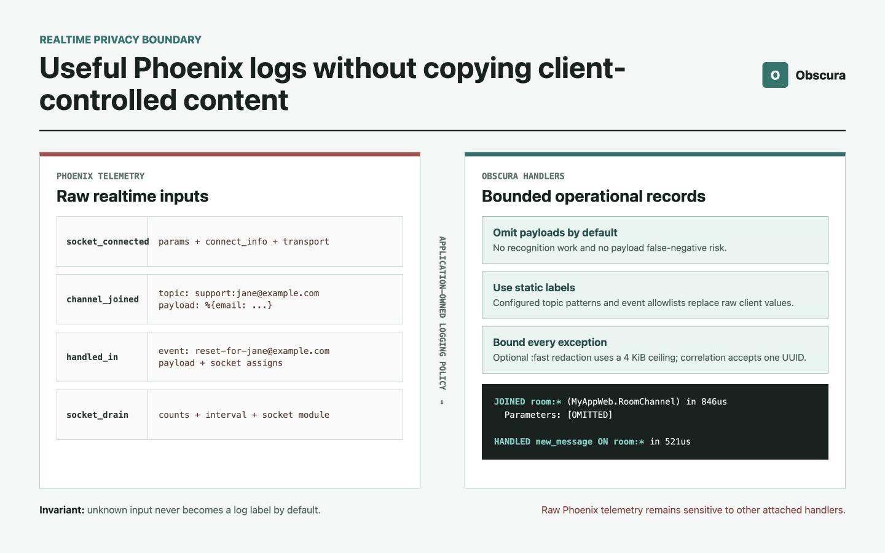

# Privacy-Safe Phoenix Socket and Channel Logging Without Exposing Payloads

An HTTP request ends. A socket can stay open for hours.

During that time it can connect, join topics, receive events, reject messages,
and carry payloads that should never become part of an operational log. The
volume is different from request logging, but that was not the hardest part of
the problem.

The harder part was ownership.

Phoenix emits socket and channel telemetry with raw, client-controlled values.
Connection parameters, topics, event names, and message payloads already exist
in the telemetry metadata before a logging handler sees the event. There is no
equivalent of an endpoint Plug that can prepare a sanitized assign first.

Disabling Phoenix's default logger prevents those values from reaching its
standard records. It also removes useful connection, drain, join, and
incoming-event visibility.

I wanted the operational signal back without rebuilding the disclosure path.

The result was two opt-in handlers: `Obscura.Phoenix.SocketLogger` and
`Obscura.Phoenix.ChannelLogger`. They omit payloads by default, emit only
bounded and validated operational fields, and allow narrow redaction and
correlation policies when an application genuinely needs them.



## The Result in One Minute

- **Problem:** Phoenix's realtime telemetry contains raw connection parameters,
  channel payloads, topics, event names, and other client-controlled values.
- **Constraint:** disabling the default logger should not leave operators blind
  to socket connections, drains, joins, and handled events.
- **Default:** connection, join, and event parameters are logged as
  `[OMITTED]`.
- **Labels:** channel topics are represented by configured patterns such as
  `room:*`; incoming event names must appear in a startup allowlist.
- **Optional data:** applications can enable bounded `:fast` redaction for a
  parameter class and one validated UUID socket assign for correlation.
- **Failure behavior:** malformed values, unsupported terms, oversized payloads,
  invalid configuration, and processing failures become fixed safe labels or
  suppress the record. They never fall back to raw values.
- **Limit:** the handlers protect only the Logger records they emit. Other
  telemetry handlers, callback logs, LiveView events, broadcasts, pushes, and
  reverse proxies remain separate boundaries.

## Why Realtime Logging Is a Different Boundary

This article builds on the request boundary described in
[Privacy-Safe Phoenix Request Logging Without Changing Controller Params](../privacy-safe-phoenix-request-logging/).
That integration has a useful handoff point:

```text
Plug.Parsers
    -> Obscura.Phoenix.Plug creates a redacted assign
    -> Obscura.Phoenix.Logger consumes only that assign
```

The application owns `conn.params`. The logging integration owns the sanitized
copy.

Socket and channel telemetry does not provide the same separation. Phoenix
publishes events such as:

```text
[:phoenix, :socket_connected]
[:phoenix, :socket_drain]
[:phoenix, :channel_joined]
[:phoenix, :channel_handled_in]
```

Their metadata can include:

- socket connection parameters;
- connection information;
- the raw channel topic;
- the incoming event name;
- join and incoming-event parameters;
- the complete socket struct and its assigns.

Those values are available to every attached telemetry handler. A replacement
logger cannot make them disappear from the event. It can only enforce a strict
rule about which representation it consumes.

That led to the realtime ownership rule:

> Phoenix owns the raw telemetry event. The logging integration owns the
> vocabulary and values that are allowed to leave it.

The important design work was defining that second set narrowly.

## Why Not Keep Phoenix's Logger and Filter a Few Keys?

Phoenix's parameter filtering is useful, and the Obscura handlers apply it as
an additional safeguard when parameter redaction is enabled. It is not a
complete realtime privacy policy.

PII does not always arrive under a predictable key:

```elixir
%{
  "message" => "Contact jane@example.com",
  "topic" => "support:jane@example.com",
  "event" => "reset-for-jane@example.com"
}
```

The values in the last two lines are especially important. Topics and event
names are often treated as harmless operational labels. In Phoenix channels
they may be influenced by a client, include record identifiers, or embed
application data.

Filtering configured parameter names does not change that.

Running Phoenix's logger beside a sanitized handler is not safe either. One
record can be correct while the other still emits the original value. Each
Obscura Phoenix logger therefore refuses to start when the corresponding
default Phoenix logger handler remains attached.

## Why the Integration Is Opt-In

Obscura does not disable `Phoenix.Logger`, rewrite endpoint configuration, or
attach realtime handlers automatically.

That would hide several operational decisions:

- whether the application needs socket or channel records at all;
- which topic categories are safe to expose;
- which incoming event names have operational value;
- whether payload visibility justifies synchronous redaction work;
- which entities belong in that policy;
- whether one correlation identifier is appropriate;
- how much additional log volume the deployment can absorb.

Installing a replacement logger also changes the semantics of its records.
Raw topics become configured patterns. Unknown events become filtered labels.
Payloads disappear unless explicitly enabled.

Those are deliberate privacy choices. A library should not make them silently.

## Install the Complete Phoenix Logging Boundary

First disable Phoenix's standard telemetry logger:

```elixir
# config/config.exs
config :phoenix, :logger, false
```

Then supervise only the replacements the application needs:

```elixir
# lib/my_app/application.ex
children = [
  MyAppWeb.Telemetry,
  MyApp.Repo,
  {Phoenix.PubSub, name: MyApp.PubSub},
  MyAppWeb.Endpoint,
  {Obscura.Phoenix.Logger, assign: :obscura_redacted},
  {Obscura.Phoenix.SocketLogger, connect_params: :omit},
  {Obscura.Phoenix.ChannelLogger,
   topic_patterns: ["room:*", "support:*", "system"],
   events: ["new_message", "typing", "mark_read"]}
]
```

The HTTP handler still requires the redacted assign prepared by
`Obscura.Phoenix.Plug`. The socket and channel handlers do not. They consume
their Phoenix telemetry events directly under stricter policies.

If only HTTP request logging is needed, install only the HTTP handler. If an
application has no channels, there is no reason to supervise the channel
handler.

## Socket Records Without `connect_info`

The socket handler restores connection and drain records:

```elixir
{Obscura.Phoenix.SocketLogger, connect_params: :omit}
```

A representative connection record looks like this:

```text
CONNECTED TO MyAppWeb.UserSocket in 312us
  Transport: Phoenix.Transports.WebSocket
  Serializer: Phoenix.Socket.V2.JSONSerializer
  Parameters: [OMITTED]
```

The handler validates the connection result, socket module, transport,
serializer, and duration before emission. Unexpected identifiers become
`[FILTERED IDENTIFIER]`; malformed measurements become `unknown`.

`connect_info` is never logged. That exclusion is unconditional because it can
contain headers, peer data, session information, and authentication context.

Socket drain telemetry contains only bounded operational measurements:

```text
DRAINING 25 of 100 total connection(s) for socket MyAppWeb.UserSocket every 1000ms - round 1 of 4
```

Counts and intervals must be non-negative bounded integers. Invalid values are
rendered as `unknown` rather than inspected.

## Omission Is the Realtime Default

The safest useful payload policy is not "redact everything." It is "do not log
payloads unless the record has a concrete operational need for them."

This is why all three realtime parameter classes default to `:omit`:

```elixir
connect_params: :omit
join_params: :omit
handle_in_params: :omit
```

Omission has three advantages:

1. There is no false-negative risk for a value that is never rendered.
2. The synchronous telemetry handler avoids recognition work.
3. Future payload fields cannot silently expand the logging surface.

Redaction remains available, but enabling it should be a schema-level decision,
not a debugging reflex.

## Topics Are Patterns, Not Raw Identifiers

Consider these topics:

```text
room:42
room:43
support:account-9351
support:jane@example.com
```

The exact suffix is rarely necessary in a general operational record. It can
also be an account identifier or PII.

The channel logger therefore emits the configured pattern that matched, not the
raw topic:

```elixir
topic_patterns: ["room:*", "support:*", "system"]
```

Representative output:

```text
JOINED room:* (MyAppWeb.RoomChannel) in 846us
  Parameters: [OMITTED]
```

An unconfigured topic becomes:

```text
[FILTERED TOPIC]
```

Patterns may be exact labels or one trailing wildcard. A wildcard-only pattern,
multiple wildcards, oversized lists, malformed UTF-8, control characters,
directional formatting characters, and labels containing high-confidence PII
are rejected during startup.

The configured pattern is copied into owned handler configuration. A log entry
does not retain the larger client frame from which the incoming topic may have
been sliced. This is the same ownership distinction explored in
[Making PII Detection Faster Without Keeping the Input Alive](../making-pii-detection-faster-without-keeping-input-alive/):
a small returned value should not retain a larger client-controlled binary.

## Event Names Use an Allowlist

Incoming channel event names receive an even stricter policy:

```elixir
events: ["new_message", "typing", "mark_read"]
```

Allowed events are emitted from the configured map:

```text
HANDLED new_message ON room:* (MyAppWeb.RoomChannel) in 521us
  Parameters: [OMITTED]
```

An event that was not declared at startup becomes:

```text
[FILTERED EVENT]
```

The handler does not echo an unknown event and then try to sanitize it. The
unknown value never becomes part of the log message.

This also prevents newline, terminal-control, and bidirectional-formatting
characters from turning a client-provided label into a misleading record.

## Optional Payload Redaction Is Deliberately Narrow

Sometimes a payload sample has real operational value. An application can opt
in independently for connection, join, and incoming-event parameters:

```elixir
{Obscura.Phoenix.SocketLogger,
 connect_params:
   {:redact,
    entities: [:email, :phone, :credit_card, :us_ssn]}}

{Obscura.Phoenix.ChannelLogger,
 topic_patterns: ["room:*"],
 events: ["new_message"],
 join_params: {:redact, entities: [:email, :phone]},
 handle_in_params: {:redact, entities: [:email, :phone]}}
```

The realtime path accepts only the dependency-light `:fast` profile and narrow
declarative options. It rejects model-backed profiles, custom recognizers,
custom operators, parser callbacks, and implicit asset preparation.

That restriction is architectural. Phoenix telemetry handlers execute
synchronously in the process emitting the event. A model download, arbitrary
callback, or unbounded inference path does not belong there.

## A Fixed Work Budget Before Recognition

Even deterministic redaction can become expensive when an attacker controls
the input shape.

Before recognition, realtime parameter rendering validates a fixed structural
budget:

- at most 64 parameter keys;
- at most 4 KiB of cumulative key text;
- at most 1,024 traversed values;
- at most 128 terms requiring PII analysis;
- bounded numeric representations;
- no structs, tuples, improper lists, or opaque map keys;
- no more than 4 KiB across cumulative key and scalar value text.

The final 4 KiB limit is specific to realtime logging. A payload above it
becomes `[FILTERED]` before PII recognition runs.

The same budget is checked again after redaction. That prevents an unexpected
transformation from expanding the object that will be inspected.

Phoenix's configured `:filter_parameters` policy is compiled when the handler
starts. Its keep and discard forms are also bounded, so a malformed or enormous
application configuration cannot move unbounded work into every channel event.

## Correlation Without Inspecting Socket State

Operationally, a join record and later incoming-event records are more useful
when they can be related. Logging every socket assign would create another
disclosure path.

The channel logger supports one narrow alternative:

```elixir
{Obscura.Phoenix.ChannelLogger,
 topic_patterns: ["room:*"],
 events: ["new_message"],
 correlation: {:socket_assign, :chat_id, :uuid}}
```

The configured assign is included only when:

- the join succeeded or an incoming event was handled;
- the assign exists;
- its value is a canonical UUID string;
- the metadata key is a bounded static identifier;
- the key is not reserved by Logger and does not contain recognized PII.

Missing or malformed values are omitted. They are not rendered as debugging
output.

There is one Phoenix lifecycle detail worth making explicit. Join telemetry
contains the socket from before `join/3` executes. An assign created inside
`join/3` cannot appear on that join record, but it is available to later
handled-event records.

This feature supports log correlation. It does not create spans, propagate
trace context, or provide distributed tracing.

## Logger Metadata Is Another Input Boundary

Channel processes can carry Logger metadata set by application code. Reusing it
implicitly would allow a safe message to be emitted with unsafe metadata.

Before writing a record, the handlers save the current Logger metadata, clear
it, emit only the validated correlation field, and restore the original
metadata afterward.

The operation is scoped to the emitting process. Application metadata remains
available after the handler returns, but it does not cross this logging
boundary.

## Startup Fails When the Raw Logger Is Still Attached

The required configuration is explicit:

```elixir
config :phoenix, :logger, false
```

Documentation alone is not enough for a privacy invariant. It is easy to add an
Obscura handler and forget that Phoenix's handler is still active.

At startup, each Obscura logger inspects the handlers attached to the Phoenix
events it replaces. If the corresponding `Phoenix.Logger` handler exists,
startup stops with an error such as:

```elixir
{:unsafe_phoenix_logger_attached, [:phoenix, :socket_connected]}
```

This check does not claim that no other telemetry handler can observe raw
metadata. It prevents the most likely configuration mistake: running the known
raw default logger next to its sanitized replacement.

## Failure Must Not Become a Debugging Leak

Telemetry metadata is not trusted just because Phoenix normally emits a
particular shape. Tests exercise missing fields, malformed measurements,
functions, opaque terms, invalid UTF-8, oversized values, and unexpected socket
maps.

The handlers apply two layers of containment:

1. field renderers accept only narrow types and return fixed safe labels;
2. the event boundary rescues exceptions and catches exits or throws.

A malformed event cannot detach the handler, invoke application inspection
protocols, or produce an exception message containing the raw value.

Failing silently is usually undesirable in business logic. This is different:
the handler is optional operational instrumentation running inside another
process. Its failure must not fail a socket connection or channel callback.

## What the Tests Prove

The integration suite exercises real Phoenix sockets and channels through a
supervised endpoint, including connections, joins, pushes, and replies. It
verifies default omission of connection data, configured redaction, bounded
topic and event labels, fail-closed handling of malformed or oversized values,
Logger metadata isolation, handler survival after failures, binary ownership,
and startup rejection when Phoenix's default logger remains enabled.

A sustained regression case performs 100 socket connections and 250 channel
pushes with parameter redaction enabled. On the development machine, five fresh
runs completed in approximately 69 to 75 milliseconds while emitting every
expected record and no raw canary value.

This guards against an accidental performance cliff. It is not a throughput
benchmark, concurrent load test, p95 latency result, or production capacity
estimate.

## What This Does Not Protect

The boundary is intentionally narrow.

These handlers do not sanitize:

- other telemetry handlers attached to the same Phoenix events;
- logs written inside `connect/3`, `join/3`, or `handle_in/3`;
- LiveView-specific telemetry or application logs;
- outbound pushes, broadcasts, or PubSub messages;
- reverse-proxy and transport-server logs;
- tracing or error-reporting integrations;
- values that the selected deterministic recognizers fail to detect.

Phoenix telemetry still contains the raw data. Any additional handler attached
to those events must be reviewed independently.

This is also why omission remains preferable when payload content is not
required. Redaction reduces exposure; omission removes that particular content
from the record entirely.

## Deployment Checklist

Before enabling the handlers in production:

1. Disable Phoenix's default telemetry logger.
2. Install only the HTTP, socket, and channel replacements the application
   needs.
3. Keep realtime parameter policies at `:omit` unless there is a documented
   operational requirement.
4. Declare a small topic-pattern vocabulary and event allowlist.
5. Use `:fast` with the narrowest relevant entity set when redaction is enabled.
6. Add sensitive application keys to Phoenix's `:filter_parameters` policy.
7. Use correlation only with a dedicated UUID assign.
8. Review every other handler attached to the same Phoenix telemetry events.
9. Exercise representative malformed and oversized payloads.
10. Measure latency and log volume under the application's expected concurrency.

## The Boundary Is a Vocabulary

The implementation started as a way to restore logs after disabling
`Phoenix.Logger`. The more useful result was a clearer model of realtime
logging.

An operational record does not need to repeat the client's vocabulary. It can
describe a connection outcome, a configured topic category, an allowed event,
a duration, and an optional correlation identifier without echoing the values
that produced them.

That is the distinction the handlers enforce:

> Realtime visibility should be built from an application-owned vocabulary,
> not copied from client-controlled content.

Once that rule is explicit, omission, static labels, bounded redaction, and
fail-closed behavior stop looking like isolated safeguards. They become parts
of the same ownership boundary.
