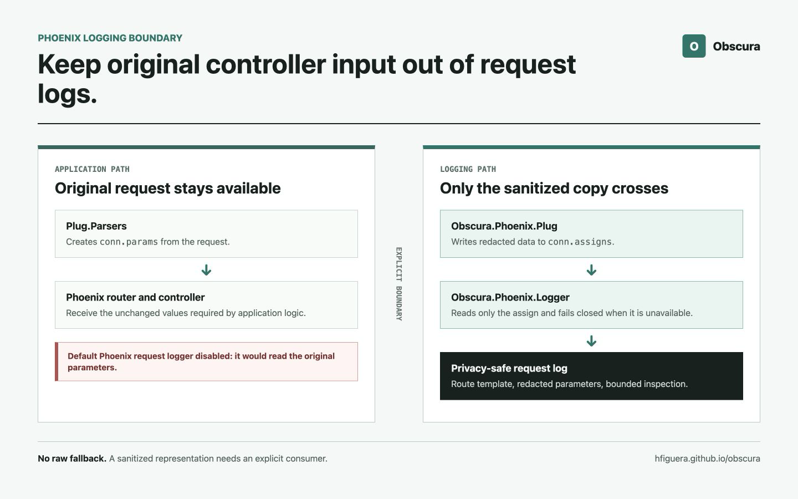

# Privacy-Safe Phoenix Request Logging Without Changing Controller Params

Redacting a copy of request parameters is not enough if another component still
logs the original connection.

That was the gap I found while integrating Obscura with Phoenix.

`Obscura.Phoenix.Plug` could already inspect structured request data and place a
redacted copy in `conn.assigns`. In `:assign_redacted` mode, controllers kept
receiving the original parameters. That was intentional: adding privacy
protection to logging should not silently change application behavior.

But Phoenix's standard router telemetry logger reads `conn.params`. The
redacted assign could be correct while the default request log still contained
the original email address, phone number, token, or card number.

The obvious fixes were incomplete:

- replacing `conn.params` protected the log but changed controller input;
- keeping only the assign preserved behavior but did not protect Phoenix's
  logger;
- filtering a few configured keys missed PII that appeared in unexpected
  fields, map keys, paths, methods, or metadata.

The result was `Obscura.Phoenix.Logger`, an opt-in telemetry handler that reads
only the sanitized assign and fails closed when that boundary is unavailable.



## The Result in One Minute

- **Problem:** assign-mode redaction did not stop Phoenix's default telemetry
  logger from inspecting the original `conn.params`.
- **Constraint:** controllers still needed the original request data.
- **Design:** disable Phoenix's default logger, create a redacted assign after
  `Plug.Parsers`, and let an Obscura telemetry handler log only that assign.
- **Failure behavior:** a missing assign, malformed term, invalid method,
  oversized parameter graph, or internal processing failure never falls back
  to raw request data.
- **Additional boundaries:** the handler logs route templates instead of raw
  paths, omits exception reasons, and excludes request-process Logger metadata.
- **Scope:** this HTTP handler does not sanitize reverse-proxy logs, realtime
  events, earlier traces, or arbitrary application logging. Those require
  independent boundaries.

## The Gap Between a Safe Copy and a Safe Log

Consider a Phoenix endpoint that parses a form and asks Obscura to create a
sanitized copy:

```elixir
plug Plug.Parsers,
  parsers: [:urlencoded, :multipart, :json],
  json_decoder: Phoenix.json_library()

plug Obscura.Phoenix.Plug,
  mode: :assign_redacted,
  fields: [:params],
  profile: :fast,
  entities: [:email, :phone, :credit_card, :us_ssn]

plug MyAppWeb.Router
```

For a request such as:

```text
POST /users/jane@example.com

email=jane@example.com&password=summer-secret
```

the connection now contains two representations:

```elixir
conn.params
#=> %{
#=>   "email" => "jane@example.com",
#=>   "password" => "summer-secret"
#=> }

conn.assigns.obscura_redacted.params
#=> %{
#=>   "email" => "[EMAIL]",
#=>   "password" => "[REDACTED]"
#=> }
```

That is the behavior I wanted. The controller can authenticate, validate, or
store the original values. Code that explicitly uses the assign gets the safe
copy.

The problem is that Phoenix's default request logger does not know about this
assign. Its router handler reads `conn.params`, so a representative log can
still look like this:

```text
POST /users/jane@example.com
Processing with MyAppWeb.UserController.create/2
  Parameters: %{"email" => "jane@example.com", "password" => "summer-secret"}
  Pipelines: [:api]
```

Nothing failed in the redaction step. The wrong representation crossed the
logging boundary.

## Why I Did Not Replace `conn.params`

`Obscura.Phoenix.Plug` also supports `mode: :replace`. That mode changes the
connection so downstream code sees the redacted values.

It is useful when the application genuinely wants sanitized data everywhere
after a boundary. It is not a transparent logging fix.

A controller expecting an email address should not suddenly receive
`"[EMAIL]"` because request logging was enabled. Authentication, validation,
database constraints, signatures, and business rules may all depend on the
original value.

This led to a clearer ownership rule:

> The application owns `conn.params`. The logging integration owns the
> redacted assign.

The logger should read only its representation. It should never use the raw
connection as a fallback.

## The Boundary

The final request flow is:

```text
HTTP request
    |
    v
Plug.Parsers
    | creates conn.params
    v
Obscura.Phoenix.Plug (:assign_redacted)
    | keeps conn.params unchanged
    | creates conn.assigns.obscura_redacted.params
    v
Obscura.Phoenix.Logger
    | reads only the assign
    | emits a sanitized route-start log
    v
Phoenix router and controller
    | continue using original conn.params
```

This ordering matters. Before `Plug.Parsers`, the body parameters may not
exist. After the router, Phoenix may already have emitted the event that the
handler needs to protect.

The plug therefore belongs after the parsers and before the router.

## Why the Logger Is Opt-In

I considered making this behavior automatic. That would have been convenient
and wrong.

First, Phoenix's logger is owned by Phoenix. A library should not silently
disable another application's logging configuration during startup.

Second, the integration changes the operational contract:

- request-start logs use a route template rather than the raw path;
- exception reasons are omitted;
- inherited Logger metadata is excluded;
- parameter logging performs bounded recognition work;
- missing preparation fails closed instead of falling back to Phoenix's
  behavior.

Third, applications have different policies. Some should log a sanitized
parameter map. Others should log no parameters at all. Entity selection,
Phoenix filter rules, request schemas, and latency budgets belong to the
application deploying the code.

Opt-in does not mean the privacy boundary is optional once selected. It means
the application must deliberately install the complete boundary.

## Installing It in a Phoenix Application

There are three required steps.

### 1. Disable Phoenix's default telemetry logger

```elixir
# config/config.exs
config :phoenix, :logger, false
```

Running both handlers defeats the design. The Obscura handler may emit a safe
record while Phoenix emits the original parameters beside it.

This setting also disables Phoenix's other standard logger handlers. Review
which socket, channel, and endpoint events the application still needs.
Obscura 0.1.3 provides separate opt-in `Obscura.Phoenix.SocketLogger` and
`Obscura.Phoenix.ChannelLogger` integrations for Phoenix realtime telemetry;
the HTTP handler does not activate or configure them.

### 2. Create the redacted assign before the router

```elixir
# lib/my_app_web/endpoint.ex
plug Plug.Parsers,
  parsers: [:urlencoded, :multipart, :json],
  pass: ["*/*"],
  json_decoder: Phoenix.json_library()

plug Obscura.Phoenix.Plug,
  mode: :assign_redacted,
  assign: :obscura_redacted,
  fields: [:params],
  profile: :fast,
  entities: [:email, :phone, :credit_card, :us_ssn, :iban, :url]

plug MyAppWeb.Router
```

The `:fast` profile is a practical default at a synchronous logging boundary.
It uses deterministic recognizers and requires no model download. The exact
entity list should reflect the application's inputs.

### 3. Supervise the telemetry handler

```elixir
# lib/my_app/application.ex
children = [
  MyAppWeb.Telemetry,
  MyApp.Repo,
  {Phoenix.PubSub, name: MyApp.PubSub},
  {Obscura.Phoenix.Logger, assign: :obscura_redacted},
  MyAppWeb.Endpoint
]
```

The handler attaches to Phoenix's router-start, endpoint-stop, and
error-rendered telemetry events. Supervision gives it an explicit lifecycle,
and stale handlers are removed during replacement or shutdown.

With the earlier request, the safe output becomes:

```text
Processing POST with /users/:id
  Parameters: %{"email" => "[EMAIL]", "password" => "[REDACTED]"}
  Pipelines: [:api]
Sent 204 in 2ms
```

The controller still receives `"jane@example.com"`. The log does not.

The mechanics are straightforward. The harder part is ensuring that every log
source and failure path respects the same ownership rule.

## The Route Template Matters

Parameters are not the only place PII appears.

A raw path can contain an email address, account number, filename, or external
identifier:

```text
/users/jane@example.com/documents/4111111111111111
```

The Phoenix router event includes the matched route template. The handler logs
that value instead:

```text
/users/:email/documents/:card_id
```

This preserves the information needed to group and search request logs without
copying path parameters into every record.

The route template is application-defined. A route with sensitive literal text
would still be a bad route and should be changed at the source.

## A Redacted Assign Still Needs Defensive Handling

The handler treats the assign as the only allowed source, but it does not
blindly call `inspect/2` on every term inside it.

Structured request data can contain values that ordinary text redaction does
not traverse safely:

- `Plug.Upload` structs with filenames and temporary paths;
- tuples with application-specific meaning;
- character lists;
- numeric values that render as card numbers;
- atoms or map keys containing PII;
- improper lists or custom terms with surprising inspection behavior.

Opaque structures are replaced with `[FILTERED]`. Character lists, atoms, and
numbers are checked before inspection. Parameter keys receive the same
high-confidence `:fast` recognition, except for bare domains because ordinary
dotted keys such as `user.name` are ambiguous.

Phoenix's configured parameter policy is applied as another layer:

```elixir
config :phoenix,
  filter_parameters: ["password", "secret", "token", "security_answer"]
```

The two mechanisms answer different questions:

- Obscura looks for supported PII formats in the sanitized representation;
- Phoenix's policy removes fields the application already knows are sensitive.

Neither should replace the other.

## Synchronous Logging Needs Work Budgets

Recognition happens in the request process when Phoenix emits its telemetry
event. That makes unbounded traversal an availability problem.

An attacker should not be able to send a deeply nested JSON document or a huge
array of numbers and turn one log statement into seconds of CPU work.

The handler therefore rejects parameter graphs that exceed any of these
limits:

| Budget | Limit |
| --- | ---: |
| Parameter keys | 64 |
| Cumulative key text | 4 KiB |
| Cumulative scalar value text | 64 KiB |
| Traversed values | 1,024 |
| Terms requiring PII analysis | 128 |
| Decimal digits in one number | 64 |

Exceeding a budget produces one value:

```text
Parameters: "[FILTERED]"
```

The handler does not attempt partial logging, and it does not fall back to raw
parameters.

## Methods, Metadata, and Failures Are Boundaries Too

HTTP methods are normally small constants such as `GET` or `POST`, but Phoenix
and Plug also support extension methods. A custom method can be attacker-facing
input depending on the server and adapter.

The handler preserves standard methods directly. A custom method must:

1. fit within 32 bytes;
2. contain only valid HTTP token characters;
3. pass high-confidence PII recognition.

Anything else becomes `[FILTERED METHOD]`. This prevents a numeric method from
exposing a card number and prevents newline or terminal-control injection into
the log stream.

Request-process Logger metadata is another independent channel. Earlier plugs
may attach user identifiers or request attributes to the process. The handler
temporarily clears that metadata while emitting its own record, then restores
it for the application.

Dynamic Phoenix log-level callbacks can also fail. If an exception escaped a
telemetry handler, Telemetry would report the exception and detach the handler.
The exception itself could contain request data. Obscura contains that failure,
emits no unsafe fallback, and keeps the handler attached for the next event.

Fail closed here means more than returning `[FILTERED]`. It means an error in
the safety mechanism must not create a second path to the original input.

## What This Integration Does Not Protect

The handler owns a narrow boundary. It does not protect:

- reverse-proxy or load-balancer access logs;
- web-server logs emitted before the Phoenix endpoint pipeline;
- Phoenix socket and channel logs unless they are separately protected by
  `Obscura.Phoenix.SocketLogger` and `Obscura.Phoenix.ChannelLogger`;
- tracing or error-reporting hooks installed before the Obscura plug;
- arbitrary `Logger` calls elsewhere in the application;
- PII formats outside the selected recognizers;
- secrets that are not recognizable as PII and are not covered by field
  policy.

It also does not make logging request parameters universally advisable. If an
application does not need parameter values for operations, the safest parameter
log is no parameter log.

## A Deployment Checklist

Before enabling this in production, I would verify all of the following:

1. Phoenix's default logger is disabled before applications start.
2. `Plug.Parsers` runs before `Obscura.Phoenix.Plug`.
3. The Obscura plug runs before the router.
4. Plug and logger use the same assign name.
5. Entity selection covers representative request formats.
6. Phoenix filter parameters cover application-specific secrets.
7. Missing assigns visibly fail closed in a staging test.
8. Route logs contain templates, not raw request paths.
9. Reverse proxies, traces, realtime handlers, and error reporters have
   independent policies.
10. Representative load tests include large and adversarial request shapes.

The integration tests in Obscura exercise real Phoenix router events, not only
direct function calls. They verify that controllers keep original parameters,
logs use the redacted assign, custom methods cannot inject controls, inherited
metadata does not escape, work budgets fail before recognition, and the handler
survives callback failures.

## The Larger Lesson

Privacy controls fail when they protect an object but not the paths by which
that object leaves the application.

Creating a redacted copy was necessary. It was not sufficient. The copy became
useful only when the logger had an explicit rule to consume it and no rule that
could fall back to the original connection.

That is why the integration is opt-in and why installation has three steps.
The application must choose the boundary, put it in the correct place, and
disable the path that bypasses it.

The implementation is specific to Phoenix, but the principle is broader:

> A privacy-safe representation needs an equally explicit consumer.

Without that consumer, the original value is still one default logger away
from crossing the boundary.
