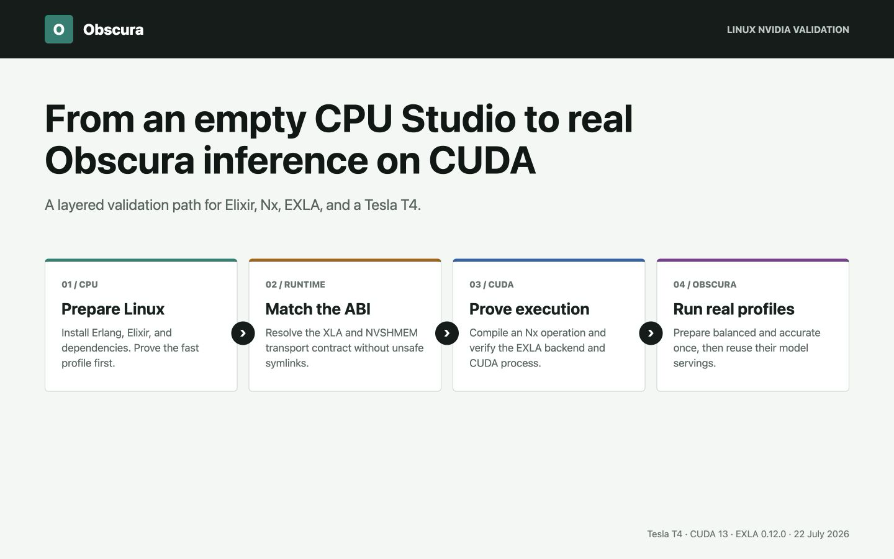
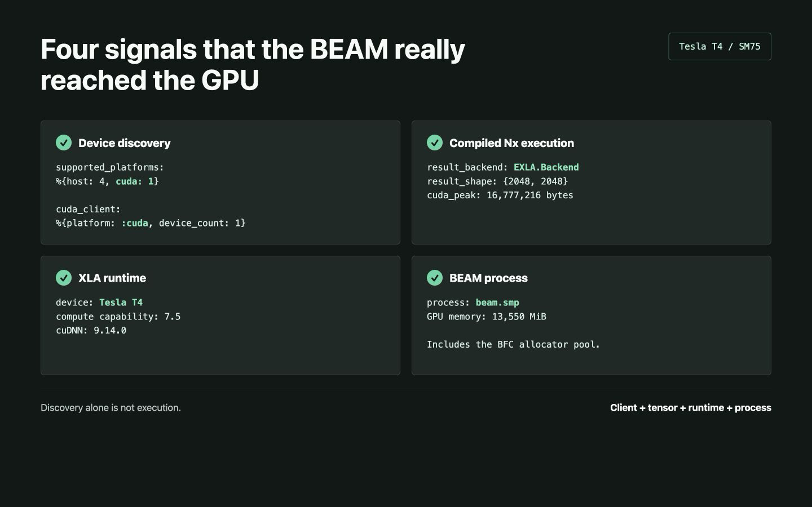
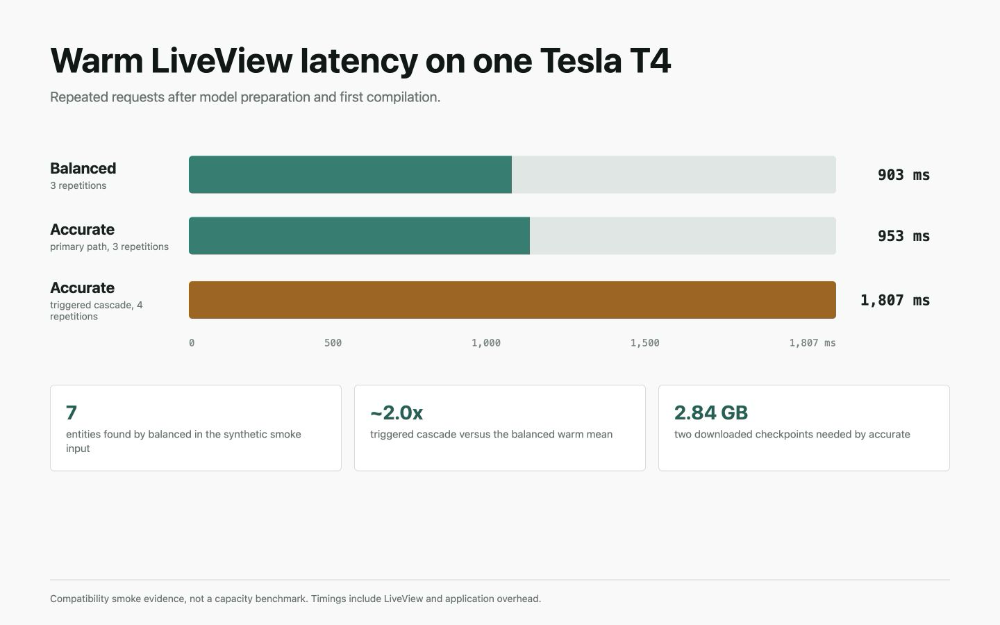

# Running Obscura on an NVIDIA GPU with Elixir, EXLA, and Lightning AI

Obscura's model-backed profiles had already been exercised on Apple Silicon. That proved the
Elixir and Nx integration on macOS, but it said nothing about Linux, CUDA, or the precompiled
EXLA runtime.

I did not have a spare Linux workstation with an NVIDIA GPU, so I used a Lightning AI Studio
with a Tesla T4. The goal was deliberately narrow: start from a CPU environment, bring up the
same Obscura example application on CUDA, and collect enough evidence to say that the BEAM was
really executing model work on the GPU.

That last part matters. Installing `:exla` is not proof of GPU execution. Neither is seeing a
CUDA client in a list. A dependency is not a device.



This article records the successful path, the NVSHMEM failure that blocked it, and the limits
of the result. It is a compatibility report, not a claim that a T4 is the best production
hardware for Obscura.

## What I wanted to prove

The test had five separate gates:

1. Phoenix and Obscura's `:fast` profile had to run on Linux before a GPU was involved.
2. EXLA had to discover a real CUDA device.
3. A compiled Nx operation had to return an `EXLA.Backend` tensor.
4. The `beam.smp` process had to appear as a CUDA consumer.
5. Obscura's `:balanced` and `:accurate` profiles had to prepare, reuse their model servings,
   and return the expected detections.

This layering saved time. When the first EXLA attempt failed, I knew the application itself
was already healthy.

## Start on CPU

[Lightning AI Studios](https://lightning.ai/docs/overview/ai-studio) are persistent cloud
development environments with terminal, browser IDE, notebook, and SSH access. I selected a
CPU machine first, installed the project toolchain, cloned
[Obscura Examples](https://github.com/hfiguera/obscura_examples), and ran its preflight checks.

Starting on CPU is useful for two reasons. It avoids spending GPU time on package installation,
and it gives you a clean baseline for failures that have nothing to do with CUDA. Lightning's
own workflow documentation also recommends preparing code and dependencies before switching
the Studio to a GPU.

The validated language versions were:

```text
Erlang/OTP 29.0.3
Elixir 1.20.2 compiled with OTP 29
```

I installed them with `mise`. On a headless machine, Erlang does not need wxWidgets:

```bash
curl https://mise.run | sh
export PATH="$HOME/.local/bin:$PATH"

export KERL_CONFIGURE_OPTIONS="--without-wx"
export KERL_BUILD_DOCS=no

mise use --global erlang@29.0.3
mise use --global elixir@1.20.2-otp-29
mix local.hex --force
mix local.rebar --force
```

The Studio home directory persists when the machine sleeps or changes hardware. That makes it
the right place for `mise`, caches, and the compatibility runtime used later. Lightning
documents the persistence rules in its
[environment guide](https://lightning.ai/docs/overview/ai-studio/environment-persistence).

One small SSH detail: my local terminal advertised `xterm-ghostty`, which the remote image did
not know. Connecting with a common terminal name fixed the immediate disconnect:

```bash
TERM=xterm-256color ssh ...
```

The CPU smoke test used the dependency-light profile and completed the default LiveView request
in 32 ms. That number is not comparable with the later model timings; it simply proved the
Linux application path before changing machines.

## Switch to a T4 and inspect the machine

After the CPU setup worked, I stopped the Studio and selected an NVIDIA Tesla T4. The observed
machine exposed:

| Component | Observed value |
|---|---|
| GPU | Tesla T4, compute capability 7.5 |
| GPU memory | 15,360 MiB |
| Driver | 580.159.03 |
| CUDA driver, runtime, and toolkit | 13.0 |
| cuDNN | 9.14.0 |
| NCCL | 2.28.3 |

I checked the machine before compiling anything:

```bash
nvidia-smi
nvcc --version
ldconfig -p | grep -E 'libcudart|libcudnn|libnccl|libnvshmem'
```

This is worth doing every time. The driver-reported CUDA capability, the installed toolkit,
and the libraries available to the dynamic loader are related, but they are not the same
thing. The correct EXLA target came from the installed CUDA toolkit: `cuda13`.

## Enable EXLA explicitly

Obscura keeps accelerator dependencies optional. The example application follows the same
rule, so the CUDA path is enabled with environment variables instead of becoming a requirement
for every user:

```bash
export OBSCURA_EXAMPLES_EXLA=1
export XLA_TARGET=cuda13
export ELIXIR_ERL_OPTIONS="+sssdio 128"

mix clean
mix deps.get
mix compile --warnings-as-errors
```

The `XLA_TARGET` value tells EXLA which precompiled archive to obtain. The scheduler dirty I/O
setting comes from the [EXLA installation guidance](https://hexdocs.pm/exla/) for complex CUDA
workloads.

For this run, the dependency versions were Nx 0.12.1 and EXLA 0.12.0. EXLA downloaded the XLA
0.10.0 archive for `x86_64-linux-gnu-cuda13`.

Then the application failed before Phoenix could start.

## The NVSHMEM ABI failure

The important part of the error was:

```text
Failed to load NIF library .../libexla:
nvshmem_transport_ibrc.so.3: cannot open shared object file
```

The Studio image had NVSHMEM 3.7.2 installed. Its transport directory contained
`nvshmem_transport_ibrc.so.6`, while the precompiled XLA archive expected ABI 3.

Those suffixes describe incompatible ABIs. Creating a `.so.3` symlink to the `.so.6` file
would make the loader look farther, but it would not make the binaries compatible. I did not
use that workaround.

Instead, I extracted NVIDIA's older package into the persistent Studio home and put only that
directory first in `LD_LIBRARY_PATH`:

```bash
mkdir -p "$HOME/.local/opt/nvshmem-3.3.24"
cd /tmp

apt-get download libnvshmem3-cuda-13=3.3.24-1
dpkg-deb -x \
  libnvshmem3-cuda-13_3.3.24-1_amd64.deb \
  "$HOME/.local/opt/nvshmem-3.3.24"

export NVSHMEM_COMPAT_DIR="$HOME/.local/opt/nvshmem-3.3.24/usr/lib/x86_64-linux-gnu/nvshmem/13"
export LD_LIBRARY_PATH="$NVSHMEM_COMPAT_DIR:/usr/local/nvidia/lib:/usr/local/nvidia/lib64:/usr/local/cuda/lib64"
```

Before trying EXLA again, I verified the exact library was present:

```bash
find "$NVSHMEM_COMPAT_DIR" \
  -name 'nvshmem_transport_ibrc.so*' \
  -print
```

This version was not chosen at random. NVIDIA's
[NVSHMEM 3.3.24 release notes](https://docs.nvidia.com/nvshmem/release-notes-install-guide/prior-releases/release-3324.html)
say that the release restores SM75 support in CUDA 13 builds. The Tesla T4 is an SM75 device.

This workaround is specific to the XLA 0.10.0 CUDA 13 archive and the image used for this test.
It should be rechecked, not copied forever, when EXLA or XLA changes.

## Prove CUDA before loading a model

With the compatible runtime ahead of the system NVSHMEM directory, EXLA loaded successfully.
I first queried the clients:

```bash
mix run --no-start -e '
{:ok, _} = Application.ensure_all_started(:exla)
platforms = EXLA.Client.get_supported_platforms()
client = EXLA.Client.fetch!(:cuda)

IO.inspect(platforms, label: "supported_platforms")
IO.inspect(
  Map.take(Map.from_struct(client), [:name, :platform, :default_device_id, :device_count]),
  label: "cuda_client"
)
'
```

The result was one CUDA device:

```text
supported_platforms: %{host: 4, cuda: 1}
cuda_client: %{name: :cuda, platform: :cuda, default_device_id: 0, device_count: 1}
```

Useful, but still not sufficient. Client discovery proves that XLA can see CUDA. It does not
prove that a computation reached it.

The next check compiled a 2048 by 2048 matrix operation with the CUDA client. The result had
`EXLA.Backend`, transferred successfully back to `Nx.BinaryBackend`, and reported a peak CUDA
allocation of 16,777,216 bytes.



At that point, the XLA log also named the Tesla T4, compute capability 7.5, and cuDNN 9.14.0.
That is the proof I wanted before downloading almost three gigabytes of model weights.

## Prepare the balanced profile

The Phoenix workbench exposes model preparation separately from inference. I selected
`:balanced`, chose EXLA, allowed downloads, and prepared the profile once. It downloaded a
1,417.56 MB TNER checkpoint and retained a reusable serving.

The first request included graph compilation and took 4,639 ms. Three subsequent requests for
the same input took 902, 909, and 897 ms.

The test text was synthetic:

```text
Rachel works at Google in Paris. Contact her at info@example.com or
+1 202-555-0188. Visit example.org. Card 4111 1111 1111 1111.
```

The profile found all seven requested values:

| Entity | Text | Byte range | Score |
|---|---|---:|---:|
| Person | Rachel | 0-6 | 0.744 |
| Organization | Google | 16-22 | 1.000 |
| Location | Paris | 26-31 | 0.993 |
| Email | info@example.com | 48-64 | 0.850 |
| Phone | +1 202-555-0188 | 68-83 | 0.750 |
| Domain | example.org | 91-102 | 0.700 |
| Credit card | 4111 1111 1111 1111 | 109-128 | 1.000 |

The BEAM process then appeared in `nvidia-smi` as a compute process using 13,550 MiB. That
large value is mainly EXLA's BFC allocator pool reservation. It is evidence that the process
owns CUDA memory, but it is not the model's weight footprint.

I also ran all five anonymization operators once. They all completed: replace, redact, mask,
hash, and pseudonymize. Those single runs are behavior checks, not a latency comparison.

## Exercise the accurate cascade

The `:accurate` profile adds a second NER model for conditional location recovery. Preparation
reused the TNER assets and downloaded another 1,417.43 MB checkpoint.

On the original sentence, TNER already accepted `Paris`, so the secondary model did not need
to run. Warm requests were 890, 1,062, and 908 ms.

To prove the cascade itself, I used a synthetic multiline record where the primary path had no
accepted location:

```text
Paula Bjelajac
Demystdata
11 Eriksbo Västergärde 98
 Suite 568
 ANGERED
 Mali
089 72 63 41 office
166-684-7899 fax
(978)645-9740x11144 mobile
```

The result included `Mali` as `LOCATION` at bytes 75-79 with an unrounded score of about
0.9996. That is the expected fingerprint of the Jean-Baptiste secondary location path.

The first triggered cascade request took 3,782 ms. Four final warm repetitions took 1,793,
1,789, 1,836, and 1,811 ms, or about twice the measured warm `:balanced` request.

It also missed `Demystdata` as an organization. That is a model miss, not a CUDA failure. The
stable cascade recovers locations; it does not run a second organization recognizer.



## What the run proves

The result closes a real compatibility gap:

- the example application runs on Linux;
- EXLA loads against CUDA 13 with a compatible NVSHMEM runtime;
- compiled Nx work executes on a Tesla T4;
- `beam.smp` owns CUDA memory during inference;
- model preparation downloads and retains reusable servings;
- `:balanced` returns deterministic and model-backed entities;
- `:accurate` exercises its conditional secondary location model;
- repeated requests reuse the prepared runtime instead of rebuilding models.

The application was served through Lightning's browser port proxy. If you reproduce the UI
part, the official
[Port Viewer guide](https://lightning.ai/docs/overview/host-web-apps/expose-web-apps)
explains how to expose a Studio port without publishing the development server directly.

## What it does not prove

This was one T4, one Studio, and one LiveView session. I did not rerun Obscura's authoritative
accuracy datasets on this host. I also did not measure concurrency, throughput, p95 or p99,
long-running memory growth, crash recovery, or thermal behavior.

The displayed timings include LiveView and application overhead; they are not isolated model
inference measurements. The `nvidia-smi` memory value includes the BFC pool. Lightning's machine
availability and account allowances can change, so check its current product terms rather than
treating this article as a promise of free T4 capacity.

In short: this proves that Obscura's public preparation and inference workflow works on Linux
with an NVIDIA T4 and EXLA CUDA. It does not turn a smoke test into a production capacity plan.

That distinction is easy to skip when the first successful output finally appears. It is also
the difference between evidence and a screenshot.

## Reproduce the application path

The complete UI is in
[Obscura Examples](https://github.com/hfiguera/obscura_examples). The library, profile behavior,
and model preparation API are documented in
[Obscura](https://hexdocs.pm/obscura/0.1.0/).

For the narrowest useful reproduction:

1. Start a Lightning Studio on CPU and install Erlang, Elixir, and the repositories.
2. Run the dependency-light checks before switching hardware.
3. Change the Studio to an NVIDIA GPU and inspect CUDA with `nvidia-smi` and `nvcc`.
4. Enable the optional EXLA dependency with the matching `XLA_TARGET`.
5. Resolve loader errors by matching real ABIs; never disguise one ABI as another with a
   symlink.
6. Prove a compiled Nx operation uses `EXLA.Backend`.
7. Prepare one Obscura profile once, then run repeated inference requests.
8. Confirm the BEAM process appears in `nvidia-smi` while the model runs.
9. Stop the GPU when the validation is complete.

That final step is mundane, but it matters. Cloud GPUs are excellent for compatibility work
when you do not own the hardware. They are also very easy to leave running.
